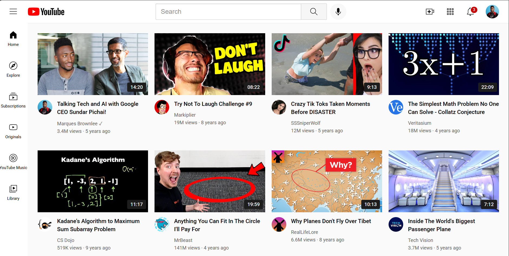

# YourTube Clone 🎥

A responsive front-end clone of YouTube built with **HTML & CSS**.  
This project focuses on replicating YouTube’s layout and design, including the header, sidebar, and video grid.  
It’s a static project (no JavaScript functionality yet) designed to showcase clean structure, responsive design, and modular CSS.

---

## ✨ Features
- Fixed header with search bar, tooltips, and notification badge
- Sidebar navigation with hover effects
- Responsive video grid (2, 3, or 4 columns depending on screen size)
- Video duration overlays on thumbnails
- Semantic HTML structure
- Modular CSS split into `general.css`, `header.css`, `sidebar.css`, and `video.css`

---

## 📸 Screenshots



---

## 🚀 How to Run
1. Clone this repository:
   ```bash
   git clone https://github.com/aasimali8-Sudo/Youtube-clone.git

2. Navigate into the project folder:
   cd Youtube-clone

3. Open index.html in your browser.
