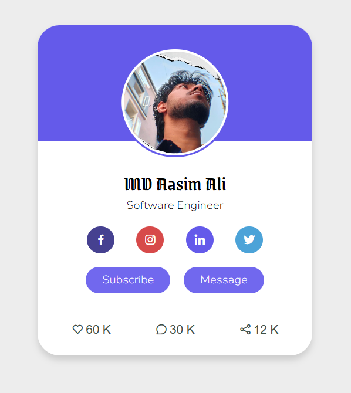

## 📇 Profile Card Project

A simple and responsive profile card built using HTML and CSS. This project focuses on clean UI design, layout structuring, and basic styling techniques.

---

## 🚀 Features
- Responsive design
- Clean and minimal UI
- Centered card layout
- Styled profile image and text
- Hover effects (if you added them — if not, remove this)

---

## 🛠️ Tech Stack
- HTML5
- CSS3

---

## 📸 Preview



---

## 🎯 What I Learned
- Structuring HTML elements properly
- Using CSS for layout and styling
- Working with flexbox / centering techniques
- Improving UI design basics

---

## 🚀 How to Run

1. Clone this repository:

```bash
   git clone https://github.com/PaSsIvE-learner-786/Web-developement-frontend-projects
```

2. Navigate into the project folder:

```bash
   cd Web-developement-frontend-projects/profileCard
```

3. Open index.html in your browser.

---

📌 Future Improvements
- Add animations
- Improve responsiveness for all devices
- Convert into a reusable component (React, etc.)

---

## ⭐ Support

    If you like this project, give it a ⭐ on GitHub.


## 👨‍💻 Author

    Aasim Ali
    GitHub: PaSsIvE-learner-786

## 📜 License

This project is open source and available under the MIT License.